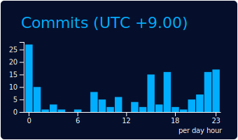

<!-- 헤더 배너 -->

  <b>◐ SNS list ◑</b> 
  

  <b>✉ Email ✉</b> 
  

---

### 안녕하세요 👋  저는 <b>권시온</b> 입니다.
“사용자의 니즈와 요구사항을 기술로 해결하는 개발자”를 지향합니다.  
단순 서비스 구현을 넘어 ** 사용자 니즈를 파악하고 사용자에게 필요한 서비스**를 만드는 데 집중합니다.  
개발자로서 끊임없이 공부하며 배움을 중요하게 생각하고 오늘도 한 걸음 성장 중입니다.

---

## 🛠 Tech Stack

---

## 🏅 BOJ / solved.ac

---

## 📊 GitHub Stats

  <!-- Most Used Languages -->
  
  <!-- GitHub Stats (점수/PR/이슈 등) -->
  

  <!-- Contribution Graph -->
  

